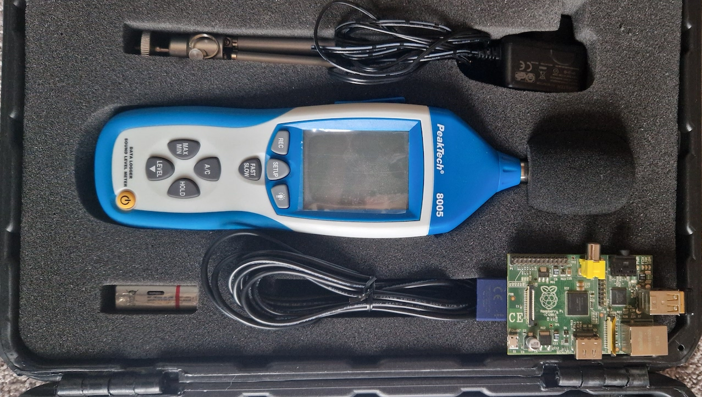
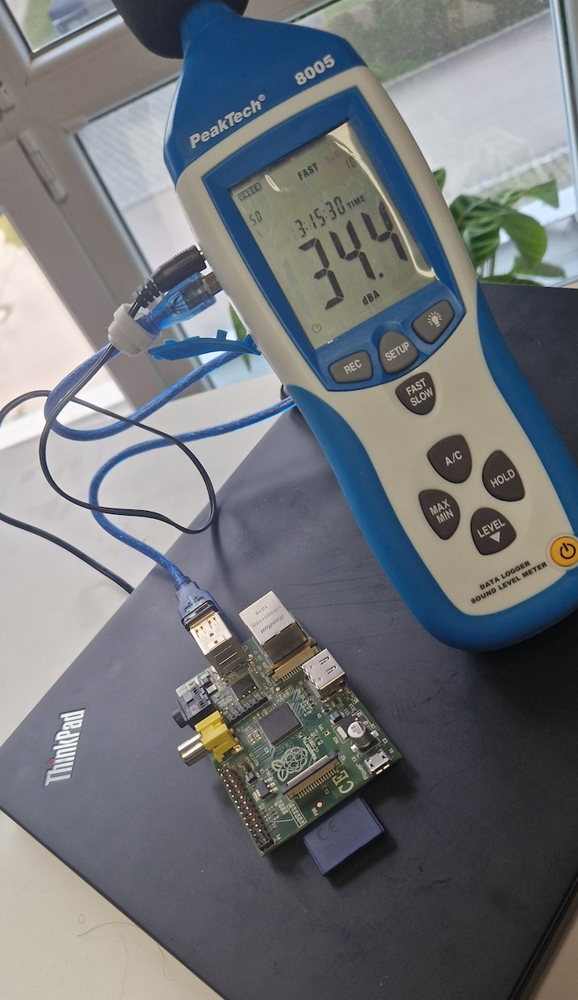

# node_pt8005 - Logger for serial data from PeakTech PT8005

## Note: This project is still a work in progress.
It provides basic functionality but may contain errors and is meant for users with development experience

This software reads data from PeakTech PT8005 Noise Meter via USB serial connection.

The measurement values are stored in a Sqlite database and can be exported via web interface.

The webinterface allows to set a location where the meter is located and if the windows are open/closed during measurement.

This allows to make different measurements for different rooms with open and closed windows to create comparable data

# Hardware Setup
* PeakTech PT8005 Noise Level Meter
* Power Supply and USB cable
* Raspberry Pi (v1 B+ or higher) or any another pc that can run Node.js

1. Place the PT8005 where you want to measure the noise level
2. Make sure to connect it to a power supply as it may turn off if powered by battery only (even if the battery is not depleted)
3. Connect the USB cable to the PT8005 and your raspberry/pc
4. Power on the PT8005 first before you start the raspberry or before you run the program on your connected pc
5. Validate that the program is receiving data via the web interface `http://ip-or-hostname:3000/`

# TODO: Add raspberry pi config and setup steps

# Usage

1. Clone this repository
2. npm install
3. npm run

Make sure the meter is connected before you start the software.
Check the name of the usb device in your /dev folder

# Example Queries and Charts
There are some example queries and charts that get statistics about the noise level exceeding common threshold values provided by german public health service
on daytime and nighttime.

## as file
To generate a PNG file on the local file system use `npm run chart -- $chartName $windowState`

## in the web interface
Navigate to `/chart/$chartName/$windowState`
